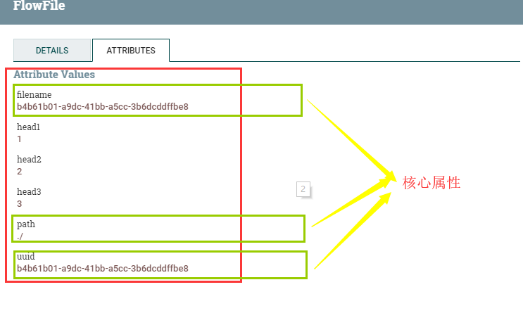
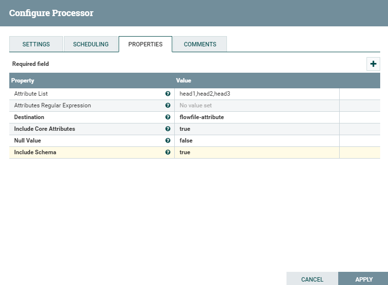
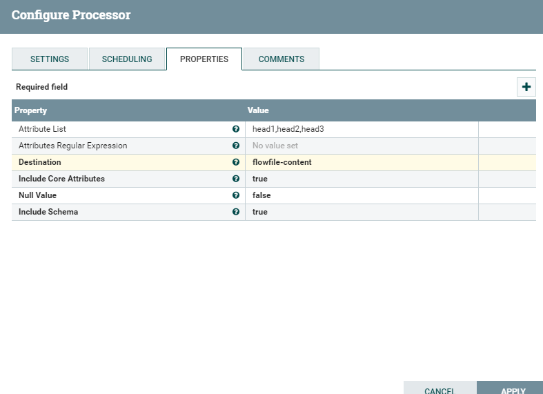

# AttributesToCSV
***
编辑人(全网同名)：__**酷酷的诚**__  邮箱：**zhangchengk@foxmail.com** 
***

## 描述

 该处理器将输入流文件属性转成CSV表示形式。生成的CSV可以被写入一个名为“CSVAttributes”的新属性，也可以作为内容写入到流文件中。如果属性值包含逗号、换行符或双引号，则属性值将用双引号转义。属性值中的任何双引号字符都用另一个双引号转义。

## 属性配置

在下面的列表中，必需属性的名称以粗体显示。任何其他属性(不是粗体)都被认为是可选的，并且指出属性默认值（如果有默认值），以及属性是否支持表达式语言。

|属性名称|默认值|可选值|描述|
|----|----|----|----|
|Attribute List|||逗号分隔的属性名列表，这些属性及属性值将包含在结果CSV中。如果该值为空，则将包含所有现有属性。此属性列表区分大小写，并支持包含逗号的属性名称。如果列表中指定的属性没有找到，它仍将被出现在最终的CSV，并根据“NULL Value”属性使用空字符串或null。如果在这个列表中指定了一个core属性，而“Include core Attributes”属性为false，则将包含core属性。 支持表达式语言:true|
|Attributes Regular Expression|||将根据流文件属性计算的正则表达式，以选择匹配的属性。此属性可与属性列表属性组合使用。最后的输出将包含ATTRIBUTE_LIST和ATTRIBUTE_REGEX中找到的匹配项的组合。 支持表达式语言:true|
|**Destination**|flowfile-attribute|▪flowfile-attribute  ▪flowfile-content|控制CSV值是作为新属性“CSVData”写入，还是写入到流文件内容中。|
|**Include Core Attributes**|true|▪true  ▪false|设置csv是否包含FlowFile org.apache.nifi.flowfile.attributes.CoreAttributes（每个流文件都有的核心属性）。核心属性将添加到CSVData和CSVSchema字符串的末尾。Attribute List配置会覆盖此设置。|
|**Null Value**|false|▪true  ▪false|如果为true，则结果CSV中不存在或为空的属性将为“null”。如果为false，将在CSV中放置一个空字符串|
|**Include Schema**|false|▪true  ▪false|如果为true，schema(属性名)也将转换为CSV字符串，该字符串将应用于名为“CSVSchema”的新属性，或者根据目标属性设置应用于内容的第一行。|

## 连接关系

|名称|描述|
|----|----|
|success|成功地将属性转换为CSV|
|failure|未能将属性转换为CSV|

## 读取属性

没有指定。

## 写属性

|名称|描述|
|----|----|
|CSVSchema|CSV 的Schema|
|CSVData|CSV 数据|

## 状态管理

此组件不存储状态。

## 限制

此组件不受限制。

## 输入要求

此组件需要传入关系。

## 系统资源方面的考虑

没有指定。

## 应用场景

该处理器就是将流文件的若干属性转成csv数据，输出到输出流文件的属性或者内容当中 。

## 示例说明

流程模板xml(1.9.2)

<a href="../template/AttributesToCSV.xml" download="AttributesToCSV.xml">AttributesToCSV.xml</a>

1：如图为GenerateFlowFile生成的流文件，AttributesToCSV配置csv输出到流属性中，csv包含核心属性 ，包含schema

配置如下：

结果为(AttributesToCSV的数据流属性)：

2：例子1中同样的配置，但输出到输出流的content中

结果为

## 公众号

关注公众号 得到第一手文章/文档更新推送。

