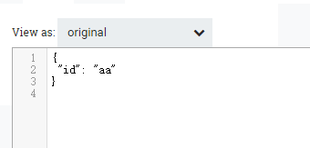

# ConvertJSONToAvro
***
编辑人(全网同名)：__**酷酷的诚**__  邮箱：**zhangchengk@foxmail.com** 
***

## 描述

该处理器根据Avro schema将JSON转换为Avro。

## 属性配置

在下面的列表中，必需属性的名称以粗体显示。任何其他属性(不是粗体)都被认为是可选的，并且指出属性默认值（如果有默认值），以及属性是否支持表达式语言。

|属性名称|默认值|可选值|描述|
|----|----|----|----|
|Hadoop configuration Resources|||	（Kite）一个文件或逗号分隔的文件列表，其中包含Hadoop文件系统配置。如果没有这个，Hadoop将在类路径中搜索“core-site.xml”和“hdfs-site.xml"或将其恢复到默认配置。 支持表达式语言:true|
|Record schema|||输出从JSON对象创建的每个记录的Avro Schema 支持表达式语言:true|
|Compression type|SNAPPY|▪BZIP2  ▪DEFLATE  ▪NONE  ▪SNAPPY  ▪LZO|压缩类型。默认是SNAPPY。|

## 连接关系

|名称|描述|
|----|----|
|success|从JSON成功转换的Avro内容|
|failure|无法处理的JSON内容|
|incompatible|无法转换的JSON内容|

## 读取属性

没有指定。

## 写属性

没有指定。

## 状态管理

此组件不存储状态。

## 限制

此组件不受限制。

## 输入要求

此组件需要传入关系。

## 系统资源方面的考虑

|资源|描述|
|----|----|
|内存|此组件的实例可能会导致系统资源的大量使用。多个实例或高并发性设置可能导致性能下降。|

## 应用场景

该处理器根据Avro schema将JSON转换为Avro。
在使用 Kite 获取 avro schema时，需要配置Hadoop配置文件；

## 示例说明

流程模板xml(1.9.2)

<a href="../template/ConvertJSONToAvro.xml" download="ConvertJSONToAvro.xml">ConvertJSONToAvro.xml</a>

1：每次只 接收一个json数据 ，无法处理json数组 。

输入json：

配置：手动配置schema 或者上下文attribute传递schema

结果为：

