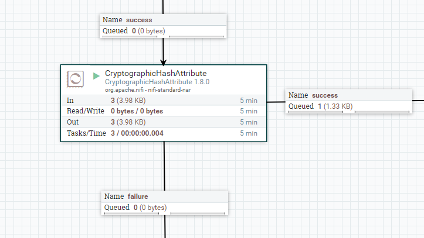
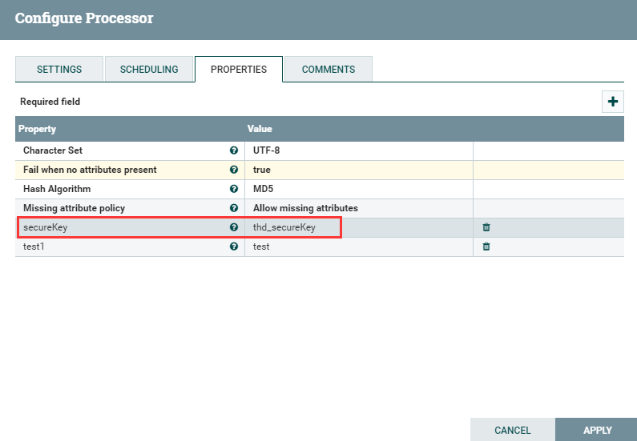

# CryptographicHashAttribute
***
编辑人(全网同名)：__**酷酷的诚**__  邮箱：**zhangchengk@foxmail.com** 
***

## 描述

该处理器使用给定算法计算每个指定属性的哈希值，并将其写入到输出属性。请参考https://csrc.nist.gov/Projects/Hash-Functions/NIST-Policy-on-Hash-Functions来决定使用哪种算法。

## 属性配置

在下面的列表中，必需属性的名称以粗体显示。任何其他属性(不是粗体)都被认为是可选的，并且指出属性默认值（如果有默认值），以及属性是否支持表达式语言。

|属性名称|默认值|可选值|描述|
|----|----|----|----|
|**Character Set**|UTF-8| ▪US-ASCII   ▪ISO-8859-1   ▪UTF-8  ▪UTF-16BE  ▪UTF-16LE  ▪UTF-16|用于解码被哈希的属性的字符集——这适用于传入的数据，而不是输出数据。|
|**Fail when no attributes present**|true|▪true  ▪false|设置为true时，如果没有找到配置的将要被哈希的属性，则路由到failure（配置的所有属性在流文件中都没有被找到）。如果设置为false，没有找到配置的将要被哈希的属性时流文件将路由到sucess(流文件中不存在任何一个该处理器配置的属性)。 (注：以上说明皆在Allow missing attributes 的前提下)|
|**Hash Algorithm**|SHA-256|▪MD2  ▪MD5  ▪SHA-1   ▪SHA-224   ▪SHA-256  ▪SHA-384  ▪SHA-512  ▪SHA-512/224   ▪SHA-512/256  ▪SHA3-224   ▪SHA3-256  ▪SHA3-384  ▪SHA3-512  ▪BLAKE2-160  ▪BLAKE2-256  ▪BLAKE2-384   ▪BLAKE2-512|要使用的加密哈希算法。|
|**Missing attribute policy**|ALLOW|▪Allow missing attributes   ▪Fail if missing attributes|选择AlLLOW，则当流文件中不含某些配置中指定的需要被哈希的属性时，则路由到success。否则，路由到failure。|

## 动态属性：

该处理器允许用户指定属性的名称和值。

|属性名称|属性值|描述|
|----|----|----|
|用于属性检查的flowfile属性键|Attribute Name|定义文件流中需要被哈希的属性. 支持表达式语言:false|

## 连接关系

|名称|描述|
|----|----|
|failure|失败|
|sucess|加密成功|

## 读取属性

没有指定。

## 写属性

|名称|描述|
|----|----|
|处理器配置需要被哈希的属性名称|处理器配置需要被哈希的属性。|

## 状态管理

此组件不存储状态。

## 限制

此组件不受限制。

## 输入要求

此组件需要传入关系。

## 系统资源方面的考虑

没有指定。

## 应用场景

将文件流中的特定属性进行哈希，用于加密等等。

## 示例说明

流程模板xml(1.9.2)

<a href="../template/CryptographicHashAttribute.xml" download="CryptographicHashAttribute.xml">CryptographicHashAttribute.xml</a>

1：Allow missing attributes 

Fail when no attributes present 设置为true，来源流文件中只包含一个secureKey属性，而该处理器配置test1属性进行MD5加密

当流文件到达该处理器，处理器匹配不到任何属性(示例中为匹配不到test1属性)，虽然选择Allow missing attributes，但还是路由到failure。

2：案例1中将Fail when no attributes present 设置为false，其他不变。

同样的这次也没有匹配到任何属性，但路由到success；

3：Allow missing attributes 

Fail when no attributes present 设置为true，来源流文件中只包含了一个secureKey属性，而该处理器配置secureKey属性进行MD5加密

来源流文件属性：

输出流文件属性：

## 公众号

关注公众号 得到第一手文章/文档更新推送。

