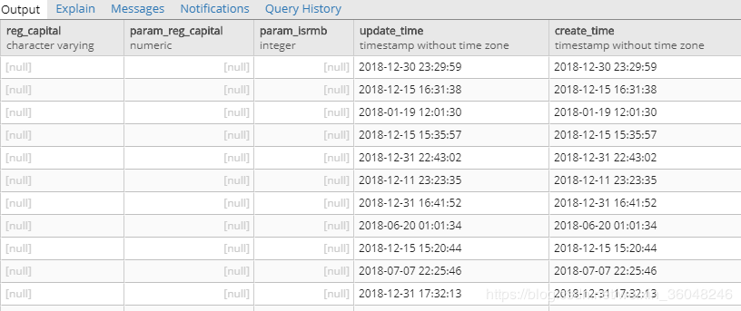
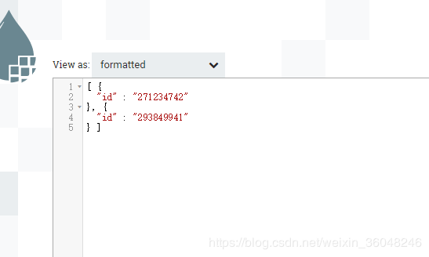
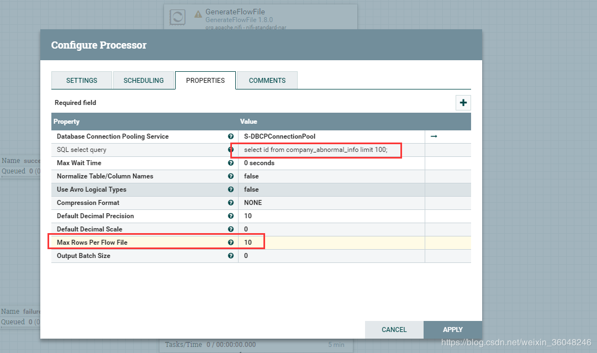
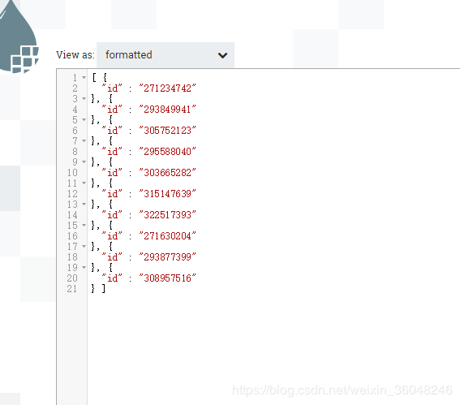
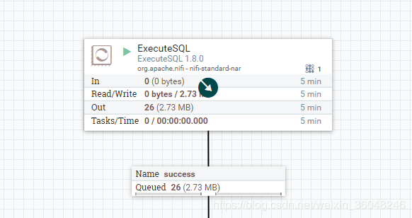

# ExecuteSQL
***
编辑人(全网同名)：__**酷酷的诚**__  邮箱：**zhangchengk@foxmail.com** 
***

## 描述

该处理器执行SQL语句，返回avro格式数据。处理器使用流式处理，因此支持任意大的结果集。处理器可以使用标准调度方法将此处理器调度为在计时器或cron表达式上运行，也可以由传入的流文件触发。SQL语句来源可以来自该处理器属性SQL select query，也可以来自上一个处理器的输出流（FlowFile的内容应采用UTF-8格式）（GenerateTableFetch，ConvertJsonToSql等等生成的流内容中的SQL语句，类似于insert into。。。value  （？。。。），这个？的值是存在于流属性中的，命名约定为sql.args.N.value  sql.args.N.type ，其中N是一个正整数。 sql.args.N.type应该是指示JDBC类型的数字。FlowFile属性'executesql.row.count'指示选择了多少行。）

## 属性

| 属性名称 | 默认值 | 可选值 | 描述 |
|--|--|--|--|
| **Database Connection Pooling Service** |  | **Controller Service API:**    DBCPService   **Implementations:**  DBCPConnectionPoolLookup  HiveConnectionPool  DBCPConnectionPool | 数据库连接池 |
| SQL Pre-Query |  |  | 用分号分隔的SQL查询列表，在执行主SQL查询之前执行。例如，在主查询之前设置会话属性。如果没有错误，这些查询的执行结果不会被输出。   **支持表达式语言** |
| SQL select query |  |  | 要执行的SQL，设置了此属性，则使用此SQL（不用流中的SQL）；不设置，则使用流中的SQL；   **支持表达式语言** |
| SQL Post-Query |  |  | 用分号分隔的SQL查询列表，在执行主SQL查询后执行。例如在主查询后设置会话属性的示例。如果没有错误，这些查询的执行结果不会被输出。   **支持表达式语言** |
| **Max Wait Time** | 0 seconds |  | 执行SQL的最大等待时间，小于1秒则系统默认此配置等于0秒，0秒即没有限制的意思，无限等待 |
| **Normalize Table/Column Names** | false | ▪ true  ▪ false | 是否将表名，列名中可能存在的avro格式不兼容的字符进行转换（例如逗号冒号转换为下划线，当然一般表名列名也不存在这些字符，应用较少，默认false） |
| **Use Avro Logical Types** | false | ▪true  ▪ false | 是否对DECIMAL/NUMBER, DATE, TIME 和TIMESTAMP类型使用Avro Logical Types。如果选择false，这些列则转成字符串形式。如果选择true,Avro Logical Types则作为其基本类型,具体来说,DECIMAL/NUMBER转换成logical 'decimal':写成带有精度的字节,DATE转换为逻辑logical“date-millis”:值写成天数（从纪元(1970-01-01)算起的整数）,TIME转换为logical“time-millis”:值写成毫秒数（从纪元(1970-01-01)算起的整数）,TIMESTAMP转换为logical“timestamp-millis”:值写成毫秒数（从纪元(1970-01-01)算起的整数）。如果Avro记录的reader也知道这些Logical Types，那么就可以根据reader的实现类结合上下文反序列化这些值。 |
| **Compression Format** | NONE | ▪ BZIP2  ▪ DEFLATE  ▪ NONE  ▪ SNAPPY  ▪ LZO | 压缩类型，默认值NONE |
| **Default Decimal Precision** | 10 |  | 精度；当一个DECIMAL/NUMBER类型的值被写成“DECIMAL”Avro Logical 类型时，需要一个特定的“precision”来表示可用具体数字的数量。通常，精度由列数据类型定义或数据库引擎默认定义。当然，某些数据库引擎也可以返回未定义的精度(0)。   **支持表达式语言** |
| **Default Decimal Scale** | 0 |  | 当一个DECIMAL/NUMBER类型被写成“DECIMAL”Avro Logical 类型时，需要一个特定的“scale”来表示可用的小数位数。通常，scale是由列数据类型定义或数据库引擎默认定义的。但是，当返回未定义的精度(0)时，一些数据库引擎的伸缩性也可能不确定。“默认十进制”用于编写那些未定义的数字。如果一个值的小数比指定的比例多，那么该值将被四舍五入，例如，1.53在比例为0时变成2，在比例为1时变成1.5。   **支持表达式语言** |
| **Max Rows Per Flow File** | 0 |  | 单个流文件中包含的最大结果行数。这意味着允许将非常大的结果集分解为多个流文件。如果指定的值为零，则在单个流文件中返回所有行。   **支持表达式语言** |
| **Output Batch Size** | 0 |  | 提交进程会话之前要排队的输出流文件的数量。当设置为零时，会话将在处理完所有结果集行并准备好将输出流文件传输到下游关系时提交。对于大型结果集，这可能导致在处理器执行结束时传输大量流文件。如果设置了此属性，那么当指定数量的流文件准备好传输时，将提交会话，从而将流文件释放到下游关系。注意:片段。在设置此属性时，不会在FlowFiles上设置count属性。   **支持表达式语言** |
| **Fetch Size** |  |  | 一次要从结果集中获取的结果行数。这是对数据库驱动程序的提示，有可能JDBC驱动并不支持。如果指定的值为零，则忽略提示。 |

## 示例说明

1：Avro Logical Types ，没有接触过的人可能会一头雾水。简单来说，数据库有自己的数据类型，avro格式数据也有自己的数据类型，两方的数据类型有些是能直接映射的，有些是需要转换的，文档中所说的DECIMAL/NUMBER, DATE, TIME 和TIMESTAMP这些来源数据的类型在avro中就无法直接映射类型；这里提供了两种解决方法，第一种是上述类型统一转成字符串类型，具体值不变；另一种是转换成avro Logical Types，但数据值会变动转换。按我使用一般这个属性设置为false，十进制/数字、日期、时间和时间戳列就写成字符串。最大的好处就是值不变（如下）

然后可以使用ConvertJsonToSql（从目标表获取元数据信息）或者写临时表，外部表等等,最后也会有很多方法成功写入到目标库。

2：SQL select query

首先设计如图一个流程：

流中是一个SQL语句  limit 1

SQL select query 属性设成 limit 2

结果发现，当SQL select query配置后，将忽略流中传过来的SQL

3：

Max Rows Per Flow File   Output Batch Size

这两个看起来都是控制输出大小的，文档看的有点迷糊；

咱们一个一个来看：

3.1 首先查一百条数据，Max Rows Per Flow File 设为10

结果是输出10个流文件，每个流文件10条数据

3.2

结果感觉跟没设置一样，及时设成成 limit 一百万 一个亿，也是输出一个流文件；当然了，这会儿一般大家都会骂娘“这NIFI太坑了！都没用！垃圾。。。”

别急，看下代码就明白什么意思了（如下图）看注释已经此处的代码逻辑，当流文件数达到了outputBatchSize的时候，这批流文件会被输出到sucess

比如配置如下，会发现流文件输出不再是一个一个的输出，而是2个为单位的输出：

不信你可以试试，output Batch size设成偶数，流增长都是偶数

同理，设为奇数，就会发现是按奇数增长的

