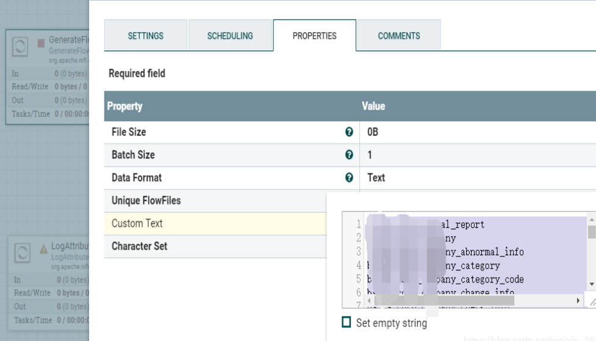
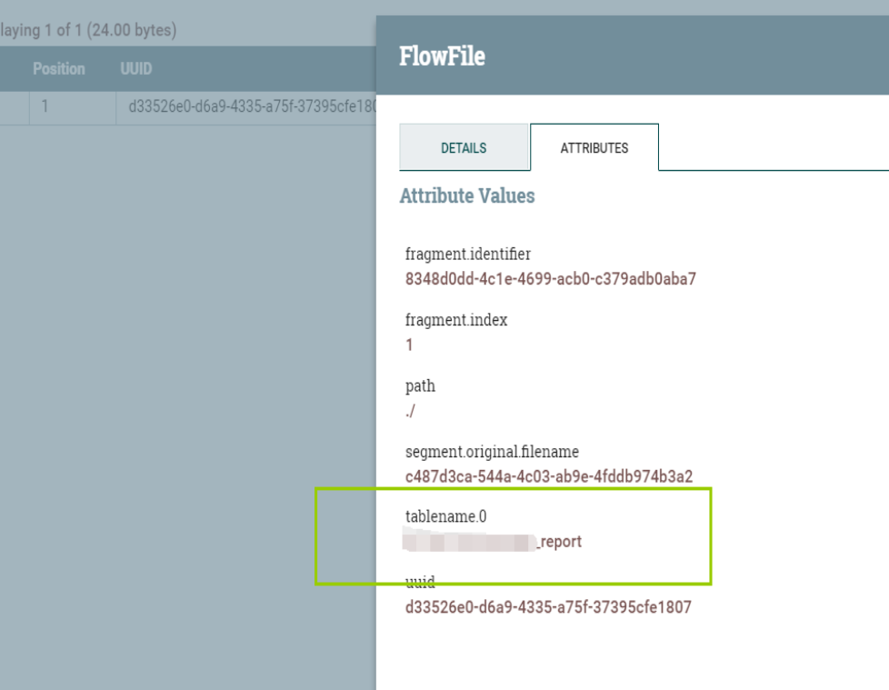

# ExtractText
***
编辑人(全网同名)：__**酷酷的诚**__  邮箱：**zhangchengk@foxmail.com** 
***

## 描述

该处理器使用正则表达式，匹配流文件中的内容，并将匹配成功的内容输出到属性中；如果正则匹配到多个结果，默认只取第一个结果；匹配成功则流文件路由matched，没有匹配则到unmatched；

## 属性配置

在下面的列表中，必需属性的名称以粗体显示。任何其他属性(不是粗体)都被认为是可选的，并且指出属性默认值（如果有默认值），以及属性是否支持表达式语言。

|属性名称|默认值|可选值|描述|
|----|----|----|----|
|**Character Set**|UTF-8||字符集|
|**Maximum Buffer Size**|||指定(每个文件)要缓冲的最大数据量，应用于正则表达式。大于指定最大值的文件部分将不会被计算匹配。|
|Maximum Capture Group Length|1024||指定给定匹配值可以拥有的最大字符数。超过最大值的字符将被截断。|
|**Enable Canonical Equivalence**|false|▪true  ▪false|当且仅当两个字符的"正规分解(canonical decomposition)"都完全相同的情况下，才认定匹配。比如用了这个标志之后，表达式"a/u030A"会匹配"?"。默认情况下，不考虑"规范相等性(canonical equivalence)"。|
|**Enable Case-insensitive Matching|false**|▪true  ▪false|是否忽略大小写；也可以使用 (?i)标志 默认情况下，大小写不明感的匹配只适用于US-ASCII字符集。这个标志(?i)能让表达式忽略大小写进行匹配。要想对Unicode字符进行大小不明感的匹配，只要将UNICODE_CASE与这个标志(?i)合起来就行了。|
|**Permit Whitespace and Comments in Pattern**|false|▪true  ▪false|在这种模式下，空格将被忽略，以#开头的嵌入注释将被忽略，直到行尾。也可以通过嵌入的标志(?x)指定。|
|**Enable DOTALL Mode**|false|▪true  ▪false|在这种模式下，表达式'.'可以匹配任意字符，包括表示一行的结束符。默认情况下，表达式'.'不匹配行的结束符。也可以通过嵌入的标志(?s)指定。|
|**Enable Literal Parsing of the Pattern**|false|▪true  ▪false|表示不应赋予元字符和转义字符特殊含义。|
|Enable Multiline Mode|false|▪true  ▪false|指示'^'和'$'应在行结束符或序列结束符之后和之前匹配，而不是只匹配整个输入的开始或结束符。也可以通过嵌入的标志(?m)指定。|
|**Enable Unicode-aware Case Folding**|false|▪true  ▪false|当与“启用不区分大小写的匹配”一起使用时，以与Unicode标准一致的方式匹配。也可以通过嵌入的标志(?u)指定。|
|**Enable Unicode Predefined Character Classes**|false|▪true  ▪false|指定与Unicode技术标准#18:Unicode正则表达式附件C:兼容性属性的一致性。也可以通过嵌入的标志(?U)指定。|
|**Enable Unix Lines Mode**|false|▪true  ▪false|只有'/n'才被认作一行的中止，并且与'.'，'^'，以及'$'进行匹配。也可以通过嵌入的标志(?d)指定。|
|**Include Capture Group 0**|true|▪true  ▪false|指示捕获组0应包含为属性。Capture Group 0表示正则表达式匹配的全部，通常不使用，可能有相当长的长度。|
|**Enable repeating capture group**|false|▪true  ▪false|如果设置为true，将提取与捕获组匹配的每个字符串。否则，如果正则表达式匹配不止一次，则只提取第一个匹配。|

## 动态属性：

该处理器允许用户指定属性的名称和值。

|属性名称|属性值|描述|
|----|----|----|
|用户自由定义的属性名称	|具有一个或多个捕获组的正则表达式|在该处理器生成的文件流上添加用户自定义的属性。如果使用表达式语言，则每批生成的流文件只执行一次计算 . 支持表达式语言:true(只使用变量注册表进行计算)|

## 连接关系

|名称|描述|
|----|----|
|unmatched|当没有提供与流文件内容匹配的正则表达式时，流文件将被路由到此关系|
|matched|当正则表达式被成功求值并因此修改了流文件时，流文件被路由到这个关系|

## 读取属性

没有指定。

## 写属性

没有指定。

## 状态管理

此组件不存储状态。

## 限制

此组件不受限制。

## 输入要求

此组件需要传入关系。

## 系统资源方面的考虑

没有指定。

## 应用场景

与[EvaluateJsonPath](./EvaluateJsonPath)有作用相似，提取content中的内容，输出到流属性当中 ；

该处理器涉及到专业的java 正则表达式知识，如果需求复杂，需要额外学习java正则相关知识 。

## 示例说明

流程模板xml(1.9.2)

<a href="../template/ExtractText.xml" download="ExtractText.xml">ExtractText.xml</a>

1：将流内容（文本）输出到流属性当中 

GenerateFlow  中手动设置一些text

最后ExactText  其他属性默认，添加一个tablename属性：

最后结果在attribute加上了我们想要的值

