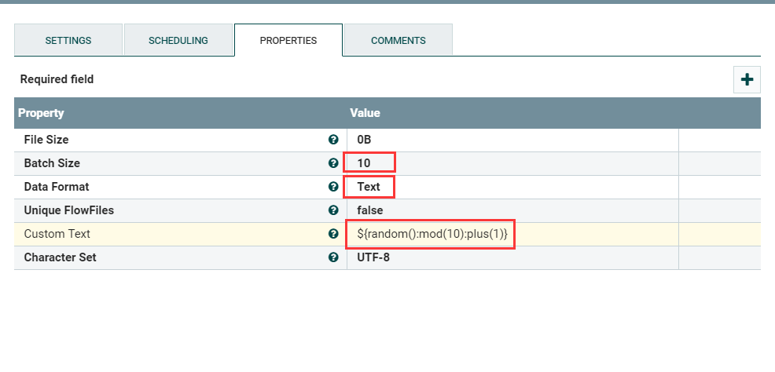

# GenerateFlowFile
***
编辑人(全网同名)：__**酷酷的诚**__  邮箱：**zhangchengk@foxmail.com** 
***

## 描述

该处理器使用随机数据或自定义内容创建流文件。GenerateFlowFile用于负载测试、配置和仿真。

## 属性配置

在下面的列表中，必需属性的名称以粗体显示。任何其他属性(不是粗体)都被认为是可选的，并且指出属性默认值（如果有默认值），以及属性是否支持表达式语言。

|属性名称|默认值|可选值|描述|
|----|----|----|----|
|**File Size**|0B||将使用的文件流的大小|
|**Batch Size**|1||每次调用时要传输出去的流文件的数量|
|**Data Format**|Text|▪Binary  ▪Text|指定数据应该是文本还是二进制|
|**Unique FlowFiles**|false|▪true  ▪false|如果选择true，则生成的每个流文件都是惟一的。 如果选择false，此处理器将生成一个随机值，所有的流文件都是相同的内容，模仿更高的吞吐量时可以这样使用|
|Custom Text|||如果Data Format选择Text，且Unique FlowFiles选择为false，那么这个自定义文本将用作生成的流文件的内容，文件大小将被忽略。 如果Custom Text中使用了表达式语言，则每批生成的流文件只执行一次表达式语言的计算 支持表达式语言:true(只使用变量注册表进行计算)|
|**Character Set**|UTF-8||指定将自定义文本的字节写入流文件时要使用的编码|

## 动态属性：

该处理器允许用户指定属性的名称和值。

|属性名称|属性值|描述|
|----|----|----|
|用户自由定义的属性名称|用户自由定义的属性值|在该处理器生成的文件流上添加用户自定义的属性。如果使用表达式语言，则每批生成的流文件只执行一次计算 . 支持表达式语言:true(只使用变量注册表进行计算)|

## 连接关系

|名称|描述|
|----|----|
|sucess||

## 读取属性

没有指定。

## 写属性

没有指定。

## 状态管理

此组件不存储状态。

## 限制

此组件不受限制。

## 输入要求

 此组件不允许传入连接关系。

## 系统资源方面的考虑

没有指定。

## 应用场景

该处理器多用于测试，配置生成设计人员所需要的特定数据，模拟数据来源或者压力测试、负载测试；

某些场景中可以作为配置灵活使用，比如设计人员想设计一个流程查询多个表，表名就可以做出json数组配置到Custom Text，之后再使用其他相关处理器生成含有不同表名属性的多个流文件，就可以实现一个流程查询多表。(额外延伸，也可以在变量注册表、缓存保存配置，通过不同的配置读取不同的表)

## 示例说明

1：该处理器生成流文件固只能作为所设计流程的第一个处理器，不允许作为其他处理器传入连接关系。

2：设置批量输出流文件，设置数据格式为Text，并且在Custom Text使用了随机数表达式。

此时每次输出10个流文件，表达式${random():mod(10):plus(1)}只执行一次，10个流文件中的文本内容是相同的。

