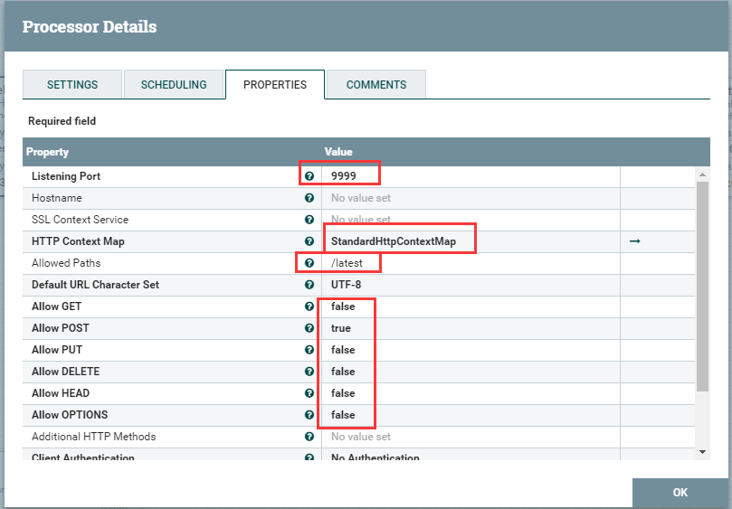
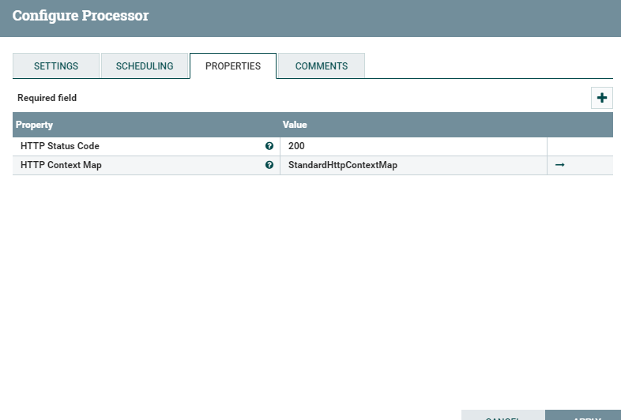

# HandleHttpRequest_HandleHttpResponse
***
编辑人(全网同名)：__**酷酷的诚**__  邮箱：**zhangchengk@foxmail.com** 
***

## 一、 HandleHttpRequest

### 描述

HandleHttpRequest该处理器启动HTTP服务器并侦听HTTP请求。对于每个请求，创建一个流文件并传输到“success”。此处理器需要与HandleHttpResponse处理器一起使用，以便创建Web服务。

### 属性配置

在下面的列表中，必需属性的名称以粗体显示。任何其他属性(不是粗体)都被认为是可选的，并且指出属性默认值（如果有默认值），以及属性是否支持表达式语言。

|属性名称|默认值|可选值|描述|
|----|----|----|----|
|**Listening Port**|80||HTTP请求端口|
|Hostname|||要绑定到的主机名。如果没有指定，将绑定到所有主机|
|SSL Context Service||Controller Service API: RestrictedSSLContextService  Implementation:  [StandardRestrictedSSLContextService]()|用于保护服务器的SSL上下文服务。如果指定，服务器将只接受HTTPS请求;否则，服务器将只接受HTTP请求|
|**HTTP Context Map**||Controller Service API:  HttpContextMap  Implementation: [StandardHttpContextMap]|用于缓存HTTP请求信息的HTTP上下文映射控制器服务|
|Allowed Paths|||指定传入URL请求中允许的有效HTTP路径的正则表达式。如果指定了这个值，并且HTTP请求的路径不匹配这个正则表达式，处理器将以404:NotFound响应|
|**Default URL Character Set**|UTF-8||HTTP请求不提供URL参数时用于解码URL参数的字符集|
|**Allow GET**|true|▪true  ▪false|允许HTTP GET方法|
|**Allow POST**|true|▪true  ▪false|允许HTTP POST方法|
|**Allow PUT**|true|▪true  ▪false|允许HTTP PUT方法|
|**Allow DELETE**|true|▪true  ▪false|允许HTTP DELETE方法|
|**Allow HEAD**|false|▪true  ▪false|允许HTTP HEAD方法|
|**Allow OPTIONS**|false|▪true  ▪false|允许HTTP OPTIONS方法|
|Additional HTTP Methods|||应该允许使用逗号分隔的非标准HTTP方法列表|
|**Client Authentication**|No Authentication|▪No Authentication  ▪Want Authentication  ▪Need Authentication||
|**Container Queue Size**|50||Http请求容器的队列大小|
|**Multipart Request Max Size**|1 MB||Http请求容器的队列大小|
|Multipart Read Buffer Size|512 KB||将传入文件的内容写入磁盘的阈值大小。只适用于内容类型:multipart/form-data的请求。它用于防止拒绝服务类型的攻击，防止填满堆或磁盘空间。|

## 连接关系

|名称|描述|
|----|----|
|sucess|接收到的所有内容都被路由到“success”关系|

## 读取属性

没有指定。

## 写属性

名称                                       | 描述                                                                                                                                                                   
---------------------------------------- | ---------------------------------------------------------------------------------------------------------------------------------------------------------------------
http.context.identifier                  | 允许HandleHttpRequest和HandleHttpResponse协调哪个流文件属于哪个HTTP请求/响应的标识符。                                                                                                      
mime.type                                | 数据的MIME类型（HTTP头“Content-Type”）                                                                                                                                       
http.servlet.path                        | 请求URL中被认为是Servlet路径的部分                                                                                                                                               
http.context.path                        | 请求URL中被认为是上下文路径的部分                                                                                                                                                   
http.method                              | 用于请求的HTTP方法，如GET或POST                                                                                                                                                
http.local.name| 服务器的IP地址/主机名                                                                                                                                                         
http.server.port                         | 服务器的监听端口                                                                                                                                                             
http.query.string                        | 请求URL的查询字符串部分                                                                                                                                                        
http.remote.host                         | 请求者的主机名                                                                                                                                                              
http.remote.addr                         | 请求者的主机名:端口                                                                                                                                                           
http.remote.user                         | 请求者的用户名                                                                                                                                                              
http.protocol                            | 通信协议                                                                                                                                                                 
http.request.uri                         | 完整的请求URL                                                                                                                                                             
http.auth.type                           | HTTP授权类型                                                                                                                                                             
http.principal.name                      | 发出请求的经过身份验证的用户的名称                                                                                                                                                    
http.subject.dn                          | 请求者的专有名称。除非将处理器配置为使用SSLContext服务，否则不会填充此值                                                                                                                            
http.issuer.dn                           | 颁发主体证书的实体的专有名称。除非将处理器配置为使用SSLContext服务，否则不会填充此值                                                                                                                      
http.headers.XXX                         | 请求中接收到的每个HTTP头都将添加为一个属性，前缀为“HTTP . Headers”。例如，如果请求包含一个名为“x-my-header”的HTTP头，那么该值将被添加到一个名为“HTTP . Header .x-my-header”的属性中。                                          
http.headers.multipart.XXX               | 在mulipart请求中接收到的每个HTTP头都将作为一个属性添加，前缀为“HTTP .header .multipart”。例如，如果多部分请求包含一个名为“content- dispose”的HTTP头，那么该值将被添加到一个名为“HTTP . Header .multipart.content- dispose”的属性中。
http.multipart.size                      | 对于内容类型为“multipart/form-data”的请求，将该部分的内容大小记录到该属性中                                                                                                                     
http.multipart.content.type              | 对于内容类型为“multipart/form-data”的请求，将该部分的内容类型记录到此属性中|                         
|http.multipart.name| 对于内容类型为“multipart/form-data”的请求，将部件的名称记录到此属性中|                                                                                                                        
http.multipart.filename                  | 对于内容类型为“multipart/form-data”的请求，当该部分包含已上载的文件时，将文件的名称记录到此属性中                                                                                                          
http.multipart.fragments.sequence.number | 对于内容类型为“multipart/form-data”的请求，将part的索引记录到这个属性中。索引从1开始。                                                                                                             
http.multipart.fragments.total.number    | 对于内容类型为“multipart/form-data”的请求，将所有部件的计数记录到此属性中。                                                                                            

### 状态管理

此组件不存储状态。

### 限制

此组件不受限制。

### 输入要求

 此组件不允许传入连接关系。

### 系统资源方面的考虑

没有指定。

## 二、HandleHttpResponse

该处理器向生成流文件的请求者发送HTTP响应。此处理器被设计为与HandleHttpRequest一起使用，以便创建web服务。

### 属性配置

在下面的列表中，必需属性的名称以粗体显示。任何其他属性(不是粗体)都被认为是可选的，并且指出属性默认值（如果有默认值），以及属性是否支持表达式语言。

名称                   | 默认值 | 可选值                                                                                          | 描述                                                         
-------------------- | --- | -------------------------------------------------------------------------------------------- | -----------------------------------------------------------
**HTTP Status Code** |     |                                                                                              | 响应HTTP请求时使用的HTTP状态代码。有关更多信息，请参见RFC 2616的第10节 **支持表达式语言**
**HTTP Context Map** |     | **Controller Service API:** HttpContextMap **Implementation:**  StandardHttpContextMap | 用于缓存HTTP请求信息的HTTP上下文映射控制器服务   

### 动态属性
该处理器允许用户指定属性的名称和值。

属性名称        | 属性值        | 描述                                                                             
----------- | ---------- | -------------------------------------------------------------------------------
用户自由定义的属性名称 | 用户自由定义的属性值 | 在该处理器生成的文件流上添加用户自定义的属性。如果使用表达式语言，则每批生成的流文件只执行一次计算 .

支持表达式语言:true(只使用变量注册表进行计算)

### 连接关系

名称      | 描述                                                                
------- | ------------------------------------------------------------------
success | 当响应成功发送给请求者后，流文件将被路由到此关系。                                         
failure | 如果处理器无法响应请求者，流文件将被路由到这个关系。例如，如果连接超时或NiFi在响应HTTP请求之前重新启动，就可能发生这种情况。

### 读取属性

Name                    | Description                                                 
----------------------- | ------------------------------------------------------------
http.context.identifier | 此属性的值用于查找HTTP响应，以便可以将正确的消息发送回请求者。如果缺少此属性，则流文件将被路由到“failure”。
http.request.uri        | 客户端请求的URI的值。                                                
http.remote.host        | 客户端的IP地址。                                                   
http.local.name         | 服务器的IP地址/主机名。                                               
http.server.port        |  服务器的监听端口。                                                  
http.subject.dn         | SSL专有名称(如果有的话)。                                             

### 写属性

没有指定。

### 状态管理

此组件不存储状态。

### 限制

此组件不受限制。

### 输入要求

此组件需要传入关系。

### 系统资源方面的考虑

没有指定。

## 应用场景

HandleHttpRequest与HandleHttpResponse一起使用，两个处理器之间可能存储其他的处理器来提供一些业务处理逻辑，以便提供一个完整的web服务。其中StandardHttpContextMap也是必须的，StandardHttpContextMap中存储的是每个请求的唯一标示。

## 示例说明

1：简单POST请求

HandleHttpRequest，配置9999端口，Allowed paths中配置/latest（如果不配置，访问则直接IP:端口），如下：

HandleHttpResponse配置如下：

 流程入下：

 
 
使用POSTMAN工具模拟执行post请求：

 

 