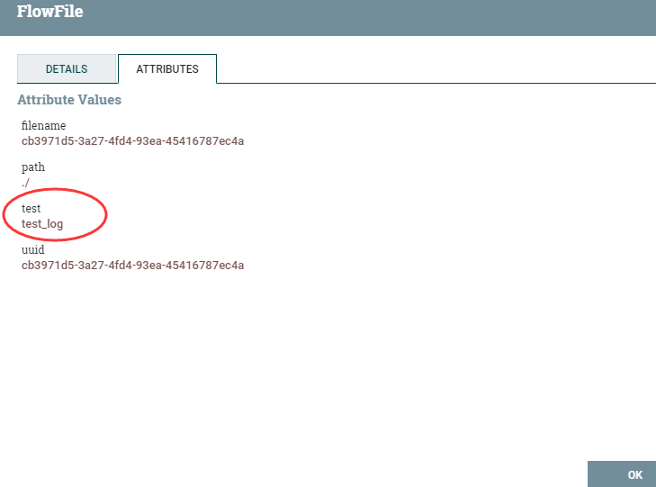
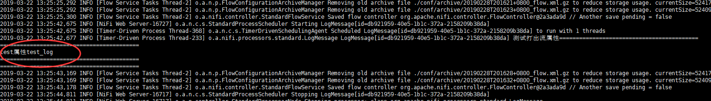

# LogMessage
***
编辑人(全网同名)：__**酷酷的诚**__  邮箱：**zhangchengk@foxmail.com** 
***

## 描述

该处理器发出指定日志级别的日志消息。

## 属性配置

属性名称          | 默认值  | 可选值                                   | 描述                                                
------------- |-------:| ------------------------------------- | --------------------------------------------------
**Log Level** | info | ▪trace  ▪debug  ▪info  ▪warn  ▪error | 输出日志时要使用的日志级别 支持表达式语言:true                       
Log prefix    |      |                                       | 日志前缀附加到日志行。它有助于区分多个LogMessage处理器的输出。 支持表达式语言:true
Log message   |      |                                       | 要发出的日志消息 支持表达式语言:true                                                                        

## 连接关系

|名称|描述|
|----|----|
|sucess||

## 读取属性

没有指定。

## 写属性

没有指定。

## 状态管理

此组件不存储状态。

## 限制

此组件不受限制。

## 输入要求

此组件需要传入关系。

## 系统资源方面的考虑

没有指定。

## 应用场景

用于输出日志，比如一个流程处理完毕，最终的流文件可以触发此流文件，打出日志。

## 示例说明

1:使用此处理器在日志中打印出流中的某个属性

输出结果

## 公众号

关注公众号 得到第一手文章/文档更新推送。

