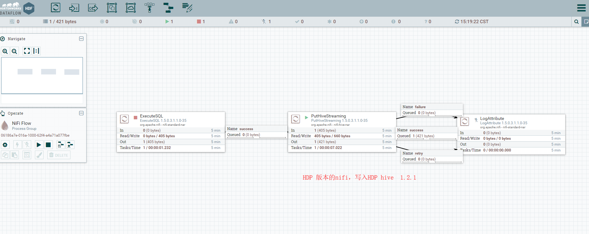

# PutHiveStreaming
***
编辑人(全网同名)：__**酷酷的诚**__  邮箱：**zhangchengk@foxmail.com** 
***


## 描述

该处理器使用Hive流将流文件数据发送到Apache Hive表。传入的流文件需要是Avro格式，表必须存在于Hive中。有关Hive表的需求(格式、分区等)，请参阅Hive文档。分区值是根据处理器中指定的分区列的名称，然后从Avro记录中提取的。注意:如果为这个处理器配置了多个并发任务，那么一个线程在任何时候只能写入一个表。写入同一表的其他任务将等待当前任务完成对表的写入。

## 属性配置

属性名称                         |  默认值  | 可选值                                                                                                       | 描述                                                                                                                                                                                                                                                                                                                                                              
---------------------------- |--------:| --------------------------------------------------------------------------------------------------------- | ----------------------------------------------------------------------------------------------------------------------------------------------------------------------------------------------------------------------------------------------------------------------------------------------------------------------------------------------------------------
**Hive Metastore URI**       |       |                                                                                                           | Hive Metastore的URI位置。注意，这不是Hive服务器的位置。Hive metastore的默认端口是9043<br>支持表达式语言:true                                                                                                                                                                                                                                                                                  
Hive Configuration Resources |       |                                                                                                           | 一个文件或着被逗号分隔的文件列表，其中包含Hive配置(hive-site.xml)。如果没有这个配置，Hadoop将在类路径中搜索'hive-site.xml'，或着使用默认配置。注意，如果要启用Kerberos等身份验证，必须在配置文件中设置适当的属性。还要注意，如果Max Concurrent Tasks被设置为一个大于1的数字，那么'hcatalog.hive.client.cache.disabled'将被迫设置为'true'以避免并发问题。请参阅Hive文档了解更多细节<br>支持表达式语言:true（只用于变量注册表）                                                                                   
**Database Name**            |       |                                                                                                           | 数据库名称  <br>支持表达式语言:true                                                                                                                                                                                                                                                                                                                                            
**Table Name**               |       |                                                                                                           | 表名  <br>支持表达式语言:true                                                                                                                                                                                                                                                                                                                                               
Partition Columns            |       |                                                                                                           | 以逗号分隔的已对表进行分区的列名列表。此列表中的值的顺序必须与表创建期间指定的分区列的顺序完全对应。  <br>支持表达式语言:true（只用于变量注册表）                                                                                                                                                                                                                                                                                     
**Auto-Create Partitions**   | true  | ▪true<br/> ▪false                                                                                            | 标志，指示是否应该自动创建分区                                                                                                                                                                                                                                                                                                                                                 
**Max Open Connections**     |   8   |                                                                                                           | 同时从这个池中分配的最大打开连接数，为负则表示没有限制。                                                                                                                                                                                                                                                                                                                                    
**Heartbeat Interval**       |  60   |                                                                                                           | 指示当经过指定的秒数时应发送心跳。值0表示不应该发送心跳。注意，尽管此属性支持表达式语言，但它不会根据传入的FlowFile属性进行计算。  <br>支持表达式语言:true（只用于变量注册表）                                                                                                                                                                                                                                                                  
**Transactions per Batch**   |  100  |                                                                                                           | 一个指向Hive流的提示，指示处理器任务将需要多少事务。这个值必须大于1。<br>支持表达式语言:true                                                                                                                                                                                                                                                                                                            
**Records per Transaction**  | 10000 |                                                                                                           | 提交事务之前要处理的记录数。这个值必须大于1。 <br>支持表达式语言:true                                                                                                                                                                                                                                                                                                                          
**Call Timeout**             |   0   |                                                                                                           | Hive流操作完成所需的秒数。值0表示处理器应该无限期地等待操作。注意，尽管此属性支持表达式语言，但它不会根据传入的FlowFile属性进行计算。  <br>支持表达式语言:true（只用于变量注册表）                                                                                                                                                                                                                                                              
**Rollback On Failure**      | false | ▪true<br/> ▪false                                                                                            | 指定如何处理错误。默认情况下(false)，如果在处理一个流文件时发生错误，该流文件将根据错误类型路由到“failure”或“retry”关系，处理器可以继续处理下一个流文件。相反（true），将回滚当前处理的流文件并立即停止进一步的处理，在这种情况下，失败的流文件将保留在输入关系中，而不会对其进行惩罚，并重复处理，直到成功处理或通过其他方法删除它。重要的是要设置足够的“Yield Duration”，以避免过于频繁地重试。注意:当一个错误发生在一个源自相同的输入FlowFile的已提交的Hive流事务,(即FlowFile包含比记录每笔交易的记录，错误发生在第二个事务或其他版本),成功记录将被转移到“成功”的关系,而原始输入FlowFile呆在输入队列。当再次处理相同的流文件时，数据会重复 。
Kerberos Credentials Service |       | **Controller Service API:**<br>KerberosCredentialsService<br>**Implementation:**<br>KeytabCredentialsService | 指定应该用于Kerberos身份验证的Kerberos凭证控制器服务                                                                                                                                                                                                                                                                                                                              
Kerberos Principal           |       |                                                                                                           | Kerberos主体进行身份验证。需要在nifi.properties中设置nifi.kerberos.krb5.file <br>支持表达式语言:true（只用于变量注册表）                                                                                                                                                                                                                                                                          
Kerberos Keytab              |       |                                                                                                           | 与主体关联的Kerberos keytab。需要在nifi.properties中设置nifi.kerberos.krb5.file  <br>支持表达式语言:true（只用于变量注册表）                                                                                                                                                                                                                                                                                                                                       

## 连接关系

名称      | 描述                                                                                                                      
------- | ------------------------------------------------------------------------------------------------------------------------
retry   | 如果传入的流文件的记录不能传输到Hive，则将其路由到此关系。注意，一些记录可能已经成功处理，它们将被路由到成功关系(作为Avro流文件)。重试、成功和失败关系的组合表明有多少记录成功和/或失败。这可以用来提供重试功能，因为不可能完全回滚。
success | 一个包含Avro记录的流文件，在该记录成功传输到Hive后路由到这个关系。                                                                                   
failure | 如果无法将Avro记录传输到Hive，则包含路由到此关系的Avro记录的流文件。                                                                                

## 读取属性

没有指定。

## 写属性

Name                       | Description                                           
-------------------------- | ------------------------------------------------------
hivestreaming.record.count | 此属性写入路由到“成功”和“失败”关系的流文件，并包含分别写入成功和未成功的传入流文件中的记录数。     
query.output.tables        | 此属性写在路由到“成功”和“失败”关系的流文件上，并在“databaseName”中包含目标表名,表的格式。

## 状态管理

此组件不存储状态。

## 限制

此组件不受限制。


## 系统资源方面的考虑

没有指定。

## 应用场景

该处理器用于向hive表写 数据，数据要求 是avro格式，要求使用者熟练使用hive。

通过 thrift nifi连hive的问题有点复杂,Apache版NIFI对应的Apache版hive，HDP版NIFI对应的HDP版hive。

连接HDP版hive时NIFI运行环境需配置hive HDFS的相关hosts,并且运行NIFI 的用户拥有hive表的读写权限。

此处理器hive支持的版本为1.2.1，不支持hive2.x,hive3.x则使用别的处理器。

## 示例说明

1：从数据库读取数据写入hive表（无分区）,Apache NIFI 1.8 - Apache hive 1.2.1

建表语句:

hive表只能是ORC格式；

默认情况下（1.2及以上版本）建表使用SQL2011关键字会报错，如果弃用保留关键字，还需另做配置；

建表时必须指明transactional = "true"

建表时需"clustered by (colName) into (n) buckets"

详情请查看hive  streaming 官方文档（https://cwiki.apache.org/confluence/display/Hive/Streaming+Data+Ingest）


```sql
CREATE TABLE demo_hive(id int,name string,day_time string)
CLUSTERED BY (name) INTO 5 BUCKETS
STORED AS ORC
TBLPROPERTIES('transactional'='true');
```


来源 库数据：


配置如下：hive的thrift要查看配置 hive-site.xml


输出结果:


2: HDP NIFI 1.5 - HDP hive 1.2.1   



## 公众号

关注公众号 得到第一手文章/文档更新推送。

