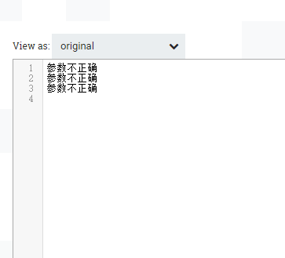

# ReplaceText
***
编辑人(全网同名)：__**酷酷的诚**__  邮箱：**zhangchengk@foxmail.com** 
***

## 描述

使用其他值替换匹配正则表达式的流文件部分内容，从而更新流文件的内容。

## 属性配置

在下面的列表中，必需属性的名称以粗体显示。任何其他属性(不是粗体)都被认为是可选的，并且指出属性默认值（如果有默认值），以及属性是否支持表达式语言。

属性名称                     | 默认值           | 可选值                                                                        | 描述                                                                                                                                                                                                                                                                                           
------------------------ | ------------- | -------------------------------------------------------------------------- | ---------------------------------------------------------------------------------------------------------------------------------------------------------------------------------------------------------------------------------------------------------------------------------------------
**Search Value**         | (?s)(^.*$)    |                                                                            | 正则表达式，仅用于“Literal Replace”和“Regex Replace”匹配策略   支持表达式语言:true                                                                                                                                                                                                                                
**Replacement Value**    | $1            |                                                                            | 使用“Replacement Strategy”策略时插入的值。   支持表达式语言:true                                                                                                                                                                                                                                              
**Character Set**        | UTF-8         |                                                                            | 字符集                                                                                                                                                                                                                                                                                          
**Maximum Buffer Size**  | 1 MB          |                                                                            | 指定要缓冲的最大数据量(每个文件或每行，取决于计算模式)，以便应用替换。如果选择了“Entire Text”，并且流文件大于这个值，那么流文件将被路由到“failure”。在“Line-by-Line”模式下，如果一行文本比这个值大，那么FlowFile将被路由到“failure”。默认值为1 MB，主要用于“Entire Text”模式。在“Line-by-Line”模式中，建议使用8 KB或16 KB这样的值。如果将<**Replacement Strategy**>属性设置为一下其中之一:Append、Prepend、Always Replace，则忽略该值
**Replacement Strategy** | Regex Replace |  ▪Prepend    ▪Append    ▪Regex Replace    ▪Literal Replace   ▪Always Replace  | 在流文件的文本内容中如何替换以及替换什么内容的策略。                                                                                                                                                                                                                                                                   
**Evaluation Mode**      | Entire text   | ▪ Line-by-Line   ▪Entire text                                               | 对每一行单独进行“替换策略”(Line-by-Line)；或将整个文件缓冲到内存中(Entire text)，然后对其进行“替换策略”。                                                                                                                                                                                                                                              

## 连接关系

名称      | 描述                                   
------- | -------------------------------------
sucess  | 已成功处理的流文件被路由到此关系。这包括已替换文本和未替换文本的流文件。
failure | 无法更新的流文件被路由到此关系。                     

## 读取属性

没有指定。

## 写属性

没有指定。

## 状态管理

此组件不存储状态。

## 限制

此组件不受限制。

## 输入要求

此组件需要传入关系。

## 系统资源方面的考虑

Resource | Description                              
-------- | -----------------------------------------
MEMORY   | 此组件的实例可能会导致系统资源的大量使用。多个实例或高并发性设置可能导致性能下降。

## 应用场景

使用正则表达式，来逐行或者全文本替换文件流内容，往往用于业务逻辑处理。

## 示例说明

1：全文本替换，配置如下

(?s)(^.*$)匹配所有值，选择正则匹配替换，全文本替换

流文件原内容：

替换后内容：

2：逐行替换：

## 公众号

关注公众号 得到第一手文章/文档更新推送。

