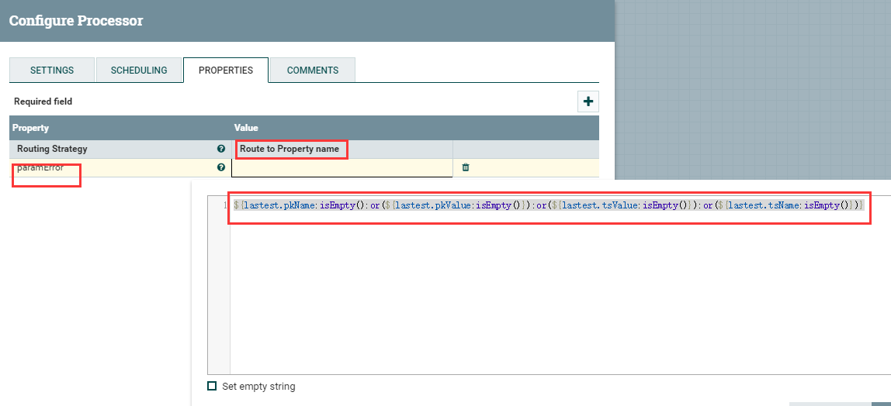

# RouteOnAttribute
***
编辑人(全网同名)：__**酷酷的诚**__  邮箱：**zhangchengk@foxmail.com** 
***


## 描述

该处理器使用属性表达式语言，根据流文件的属性去计算然后进行路由。

## 属性配置

在下面的列表中，必需属性的名称以粗体显示。任何其他属性(不是粗体)都被认为是可选的，并且指出属性默认值（如果有默认值），以及属性是否支持表达式语言。

属性名称                 | 默认值                    | 可选值                                                                                               | 描述                   
-------------------- | ---------------------- | ------------------------------------------------------------------------------------------------- | ---------------------
**Routing Strategy** | Route to Property name | ▪ Route to Property name <br/> ▪Route to 'matched' if all match <br/> ▪Route to 'matched' if any matches  | 指定如何确定在计算表达式语言时使用哪个关系                                                                                                                                                                              

## 动态属性

该处理器允许用户指定属性的名称和值。

属性名称                             | 属性值                                         | 描述                                                       
-------------------------------- | ------------------------------------------- | ---------------------------------------------------------
用户自由定义的属性名称<br>(Relationship Name)| 用户自由定义的属性值<br>(Attribute Expression Language)| 将其属性与动态属性值中指定的属性表达式语言相匹配的流文件路由到动态属性键中指定的关系.<br>支持表达式语言:true

## 连接关系

名称        | 描述                      
--------- | ------------------------
unmatched | 不匹配任何用户定义表达式的流文件将被路由到这里  

## 自定义连接关系

可以根据用户配置处理器的方式创建动态连接关系。

Name     | Description       
-------- | ------------------
动态属性的属性名 | 匹配动态属性的属性表达式语言的流文件

## 读取属性

没有指定。

## 写属性

Name                   | Description
---------------------- | -----------
RouteOnAttribute.Route | 流文件路由到的关系  

## 状态管理

此组件不存储状态。

## 限制

此组件不受限制。

## 输入要求

此组件需要传入关系。

## 系统资源方面的考虑

没有指定。

## 应用场景

该处理器往往用于判断逻辑。

## 示例说明

1：判断属性中多个值是否为空，不同判断结果执行不同逻辑

自定义paramError属性，
```js
${lastest.pkName:isEmpty():or(${lastest.pkValue:isEmpty()}):or(${lastest.tsValue:isEmpty()}):or(${lastest.tsName:isEmpty()})}
//意思是四个流文件属性如果有一个为空，则返回true
```



输入流属性如下，要求非空的属性中有空值：


结果如下：路由到paramError关系


## 公众号

关注公众号 得到第一手文章/文档更新推送。

