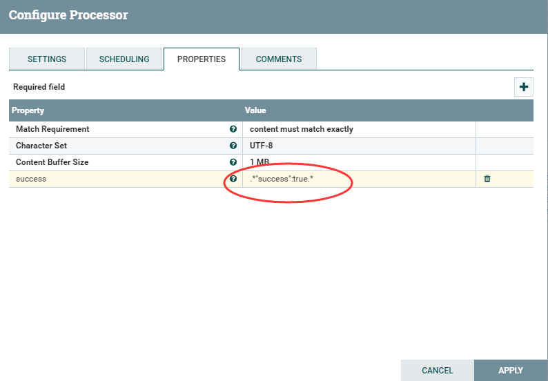
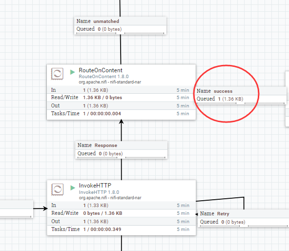

# RouteOnContent
***
编辑人(全网同名)：__**酷酷的诚**__  邮箱：**zhangchengk@foxmail.com** 
***

## 描述

该处理器使用正则表达式去匹配流文件的内容，并将流文件路由到正则表达式所匹配的relation。在用户自定义的属性上添加正则表达式，其中属性的名称是关系的名称，值是一个正则表达式，用于匹配流文件内容。用户定义的属性支持属性表达式语言，但是表达式计算的结果被解释为文字值，而不是正则表达式。

## 属性配置

在下面的列表中，必需属性的名称以粗体显示。任何其他属性(不是粗体)都被认为是可选的，并且指出属性默认值（如果有默认值），以及属性是否支持表达式语言。

属性名称                    |            默认值             | 可选值                                                       | 描述                                                        
----------------------- |-----------------------------:| --------------------------------------------------------- | ----------------------------------------------------------
**Match Requirement**   | content must match exactly | ▪ content must match exactly  ▪content must contain match | 指定文件流的整个内容是否必须与正则表达式完全匹配，或者文件的任何部分(内容缓冲区大小范围内)是否可以被正则表达式匹配
**Character Set**       |           UTF-8            |                                                           | 文件编码所在的字符集                                                
**Content Buffer Size** |            1 MB            |                                                           | 指定缓冲的最大数据量，以便使用正则表达式。如果流文件的大小超过这个值，那么这个值意外的任何数据在正则匹配时都将被忽略                                                                                                                                                                     

## 动态属性

该处理器允许用户指定属性的名称和值。

属性名称                           | 属性值   | 描述                                                                
------------------------------ | ----- | ------------------------------------------------------------------
用户自由定义的属性名称(Relationship 名称) | 正则表达式 | 将内容与动态属性值定义的正则表达式匹配的流文件路由到动态属性键定义的关系 支持表达式语言:true(使用流文件属性和变量进行计算)

## 连接关系

名称        | m描述                        
--------- | ---------------------------
unmatched | 未被正则表达式匹配的流文件将路由到unmatched

## 自定义连接关系

可以根据用户配置处理器的方式创建动态连接关系。

Name     | Description       
-------- | ------------------
动态属性的属性名 | 匹配动态属性的属性表达式语言的流文件

## 读取属性

没有指定。

## 写属性

没有指定。

## 状态管理

此组件不存储状态。

## 限制

此组件不受限制。

## 输入要求

此组件需要传入关系。

## 系统资源方面的考虑

没有指定。

## 应用场景

该处理器用于路由，控制流文件去向。

## 示例说明

1：比如进行一次Http请求，请求返回的数据中有字符串   "success":true 表名此次请求成功

