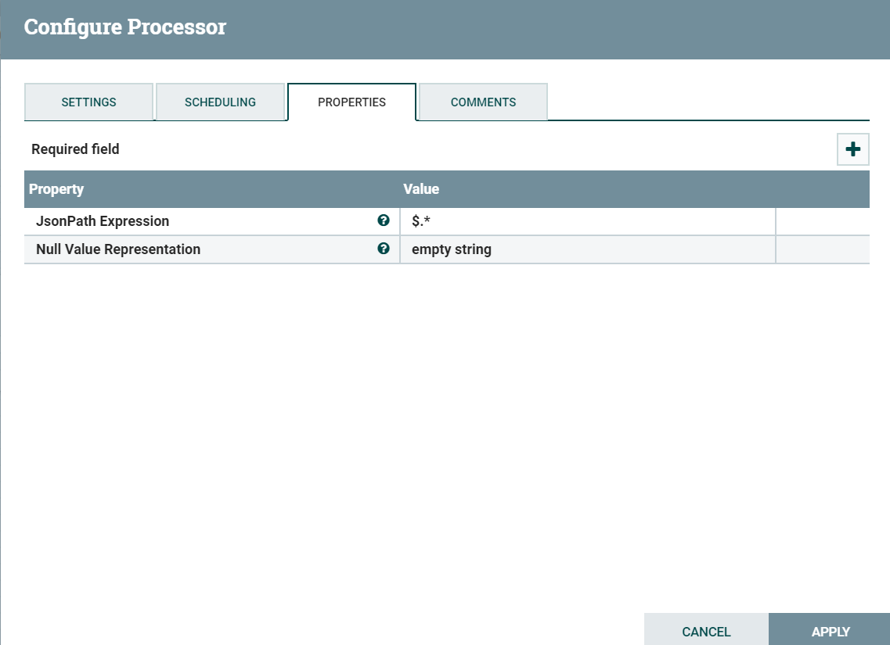
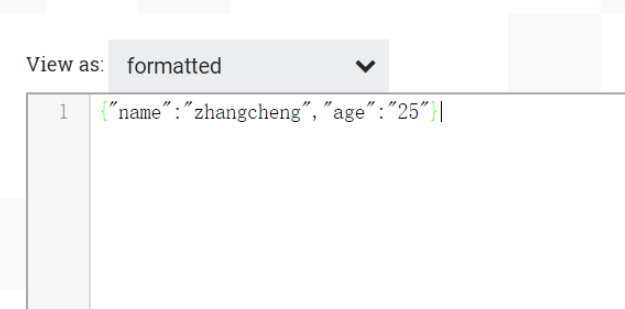
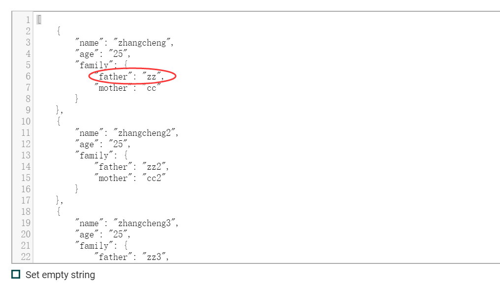
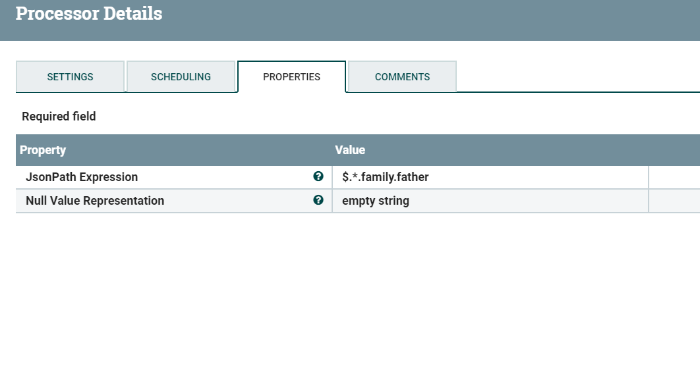

# SplitJson
***
编辑人(全网同名)：__**酷酷的诚**__  邮箱：**zhangchengk@foxmail.com** 
***

## 描述

该处理器使用JsonPath表达式指定需要的数组元素，将JSON数组分割为多个单独的流文件。每个生成的流文件都由指定数组的一个元素组成，并传输到关系“split”，原始文件传输到关系“original”。如果没有找到指定的JsonPath，或者没有对数组元素求值，则将原始文件路由到“failure”，不会生成任何文件。

该处理器需要使用人员掌握JsonPath表达式语言。

## 属性配置

在下面的列表中，必需属性的名称以粗体显示。任何其他属性(不是粗体)都被认为是可选的，并且指出属性默认值（如果有默认值），以及属性是否支持表达式语言。

|属性名称|默认值|可选值|描述|
|----|----|----|----|
|JsonPath Expression|||一个JsonPath表达式，它指定用以分割的数组元素。|
|Null Value Representation|1|▪empty string  ▪the string 'null'|指定结果为空值时的表示形式。|

## 连接关系

|名称|描述|
|----|----|
|failure|如果一个流文件处理失败(例如，流文件不是有效的JSON数组或者指定的JsonPath路径不存在)，它将被路由到这个关系|
|original|被分割成段的原始流文件。如果流文件处理失败，则不会向该关系发送任何内容|
|split|成功分割的流文件结果路由到这个关系|

## 读取属性

没有指定。

## 写属性

|名称|描述|
|----|----|
|fragment.identifier|从同一个父流文件生成的所有分割流文件都将为该属性添加相同的UUID(随机生成)|
|fragment.index|一个增长的数字，表示从单个父流文件创建的分割流文件的顺序|
|fragment.count|从父流文件生成的分割流文件的数量|   
|segment.original.filename|父流文件的文件名|

## 状态管理

此组件不存储状态。

## 限制

此组件不受限制。

## 输入要求

此组件需要传入关系。

## 系统资源方面的考虑

|资源|描述|
|----|----|
|内存|分割生成的流文件，以及被分割流文件的全部内容(作为JsonNode对象)会读入内存。由于JSON的大小或由于配置输出大量的分割文件，则可能过度使用内存，此时可能需要分阶段进行来避免过度使用内存。|

## 应用场景

该处理器主要用于分割json数组，灵活运用时也可做数据清洗(比如需要抽取json中某一个字段)。

## 示例说明

1:下面是该处理器应用最多的情况，如下图为一json数组

在SplitJson中配置JsonPath为  $.* (匹配数组任意元素)

split关系中输出3个分割文件，original关系中输出被分割原文件。

2：举例说明该处理器的复杂使用，如下图为一多层次结构json数组，需要分割取出json数组中的father字段。

配置JsonPath为$.*.family.father

结果：

