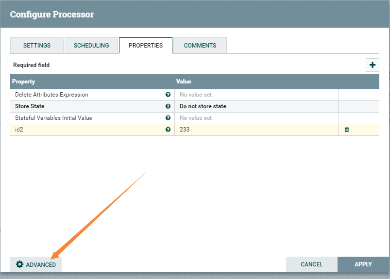
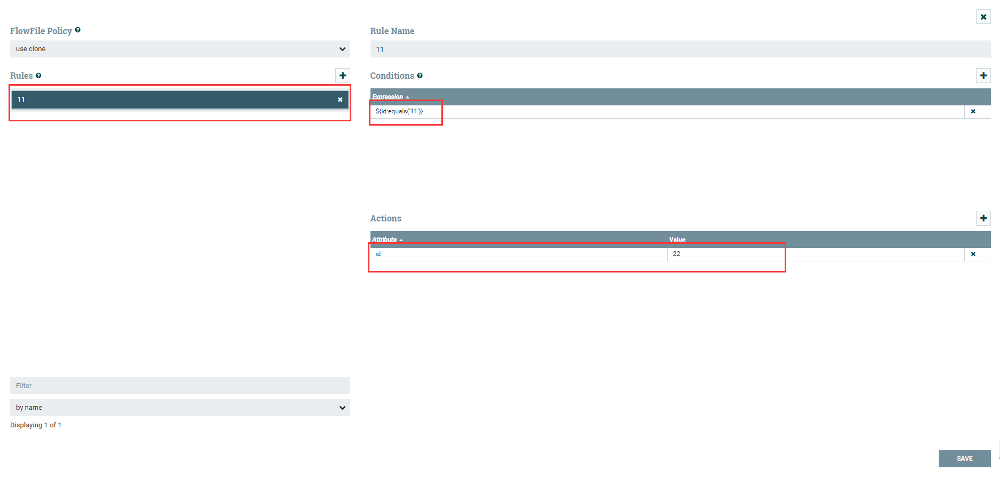
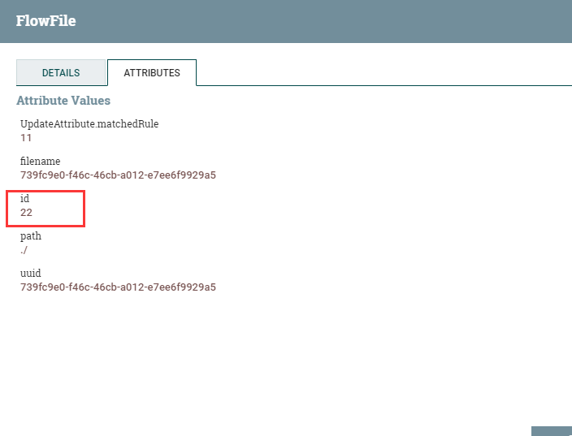
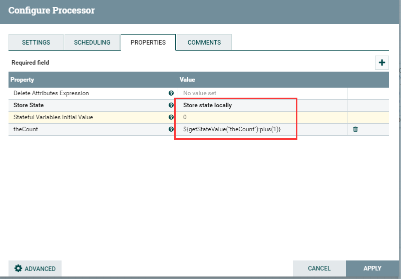
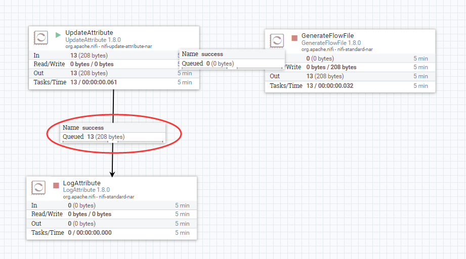

# UpdateAttribute
***
编辑人(全网同名)：__**酷酷的诚**__  邮箱：**zhangchengk@foxmail.com** 
***

## 描述

该处理器使用属性表达式语言更新流文件的属性，并且/或则基于正则表达式删除属性

## 属性配置

在下面的列表中，必需属性的名称以粗体显示。任何其他属性(不是粗体)都被认为是可选的，并且指出属性默认值（如果有默认值），以及属性是否支持表达式语言。

属性名称                             |        默认值         | 可选值                                        | 描述                                                                                                    
-------------------------------- |---------------------:| ------------------------------------------ | ------------------------------------------------------------------------------------------------------
Delete Attributes Expression     |                    |                                            | 删除的属性正则表达式 支持表达式语言:true                                                                              
**Store State**            | Do not store state |▪Do not store state  ▪Store state locally | 选择是否存储状态。                                                                                             
Stateful Variables Initial Value |                    |                                            | 如果使用**Store State**，则此值用于设置有状态变量的初值。只有当状态不包含变量的值时，才会在@OnScheduled方法中使用。如果是有状态运行，这是必需配置的，但是如果需要，这可以是空的。                                                                                                                                                                     

## 动态属性

该处理器允许用户指定属性的名称和值。

属性名称                        | 属性值               | 描述                                                           
--------------------------- | ----------------- | -------------------------------------------------------------
用户自由定义的属性名称(将要update的属性名)| 用户自由定义的属性值| 用动态属性的值指定的值更新由动态属性的键指定的FlowFile属性 支持表达式语言:true(只使用变量注册表进行计算)

## 连接关系

名称             | 描述                                              
-------------- | ------------------------------------------------
sucess         | 所有成功的流文件都被路由到这个关系                              
set state fail | 如果处理器正在有状态地运行，并且在向流文件添加属性后没有设置状态，那么流文件将被路由到这个关系。

## 读取属性

没有指定。

## 写属性

Name                   | Description       
---------------------- | ------------------
See additional details | 该处理器可以编写或删除零个或多个属性

## 状态管理

Scope | Description                             
----- | ----------------------------------------
LOCAL | 提供一个选项，不仅将值存储在流文件中，还将值存储为要以递归方式引用的有状态变量。

## 限制

此组件不受限制。

## 输入要求

此组件需要传入关系。

## 系统资源方面的考虑

没有指定。

## 应用场景

该处理器基本用法最为常用，及增加，修改或删除流属性；

此处理器使用用户添加的属性或规则更新FlowFile的属性。有三种方法可以使用此处理器添加或修改属性。一种方法是“基本用法”; 默认更改通过处理器的每个FlowFile的匹配的属性。第二种方式是“高级用法”; 可以进行条件属性更改，只有在满足特定条件时才会影响FlowFile。可以在同一处理器中同时使用这两种方法。第三种方式是“删除属性表达式”; 允许提供正则表达式，并且将删除匹配的任何属性。

请注意，“删除属性表达式”将取代发生的任何更新。如果现有属性与“删除属性表达式”匹配，则无论是否更新，都将删除该属性。也就是说，“删除属性表达式”仅适用于输入FlowFile中存在的属性，如果属性是由此处理器添加的，则“删除属性表达式”将不会匹配到它。

## 示例说明

1：基本用法增加一个属性

结果输出：

2：高级用法，添加规则条件，符合条件时update指定的属性值

点击ADVANCED

添加一个rule,如果id的值等于11，就修改id的值为22

结果输出：

3：高级用法 存储状态,记录通过该处理器的数据流总和

结果输出：

