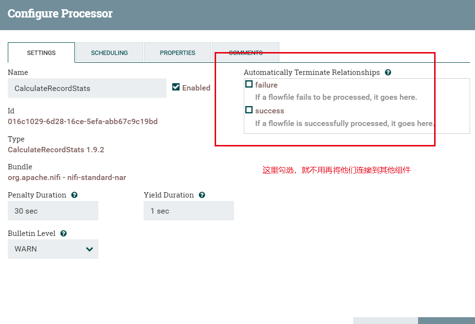
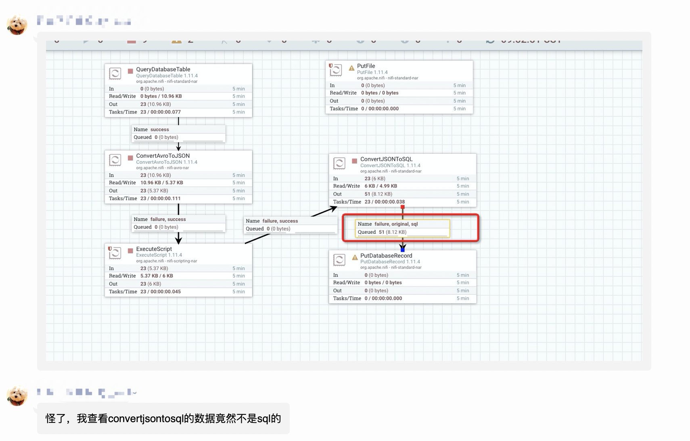

[首页](../README.md) [赞赏支持](./donate.md) [QQ群](./qq.md) [微信公众号](./wechat.md) [更新日志](./updateLog.md) [新手常见问题](./newQuestions.md) 

# 新手常见问题

慢慢汇总，有新手想问的可以直接下方留言

### Q1 是不是组件每种连接关系(suceess和failure等)都要有所对应？

首先NIFI是基于流式处理数据，那么数据就会有移动方向，连接关系就是帮助我们路由数据的。简单的我们可以把一个组件的连接关系连向下一个组件，但有的时候我们不关心某些连接，比如说failure、original等等，我们可以通过如下图设置而不用将他们连接到别的组件。

### Q2 组件已经正常运行了，右上角怎么还在报错？

组件右上角的报错信息是默认存在一段时间的，报错信息都是有时间戳的，可以根据时间戳来判断报错信息是否是正在发生的。

### Q3 为啥用Select组件查询出来的数据都是重复的？

每个组件都有几种调度触发方式，常见的有

* 每隔一段时间执行一次
* 特定时间执行一次
* 上游有数据就立刻执行(假设没有被背压)

那么新手遇到的这种问题应该就是调度问题了，想做的是一次性查询，但是默认的调度执行了很多次

### Q4 Processor这么多路由(RelationShip) 用哪一个 怎么用

新手易犯的错误，把所有的路由都连到了下游组件。切记，每个路由通常都有不同的作用，首先你要搞明白这些路由是干什么，什么意思，比如常见的success就是成功